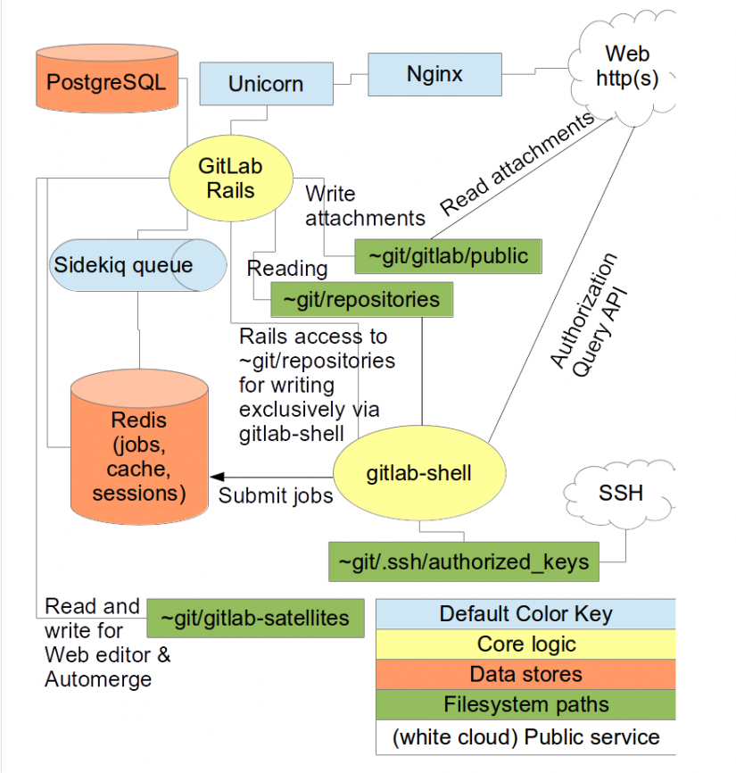

# TỔNG QUAN VỀ GITLAB
---
## 1. GitLab là gì?
`GitLab` khá nổi tiếng và là một mã nguồn mở của máy chủ Git được thực hiện bởi hơn 50.000 tổ chức. Trong vài năm gần đây Gitlab đã phát triển mạnh mẽ với sự hỗ trợ của cộng đồng mạng, hàng nghìn người sử dụng trên một máy chủ duy nhất hoặc một số máy chủ hoạt động tương tự. Nếu bạn cần thiết lập một máy chủ Git, thì GitLab cung cấp cho bạn một giải pháp hoàn hảo.

`Gitlab` là một hệ thống `self-hosted` để quản lý mã nguồn của bạn. Bản đầu tiên được phát hành vào tháng 10/2011 và được cập nhật vào ngày 22 hàng tháng. Gitlab được phát hành theo tiêu chuẩn của MIT.

Gitlab được thành lập bởi Dmitriy Zaporozhets năm 2013. Dự án bao gồm hai nhóm chính: một bên là “open source core team” và một bên là "GitLab B.V. team" (chi nhánh của công ty Gitlab).

GitLab được sử dụng để lư trữ trên Github, nhưng với sự nỗ lực của Dmitriy Zaporozhets suốt một năm làm việc tại GitLab, kể từ tháng 1/2014 mã nguồn được lưu trữ trên sever chính của gitlab là gitlab.com. Các nhánh của GitLab được lưu trữ trên github, sẽ hoạt động như một source, nơi bạn có thể pull, push và merge các yêu cầu.

## 2. Đặc điểm của GitLab
GitLab hỗ trợ ba phiên bản:
- `Gitlab community editon (CE)` - Gitlab phiên bản cộng đồng: là phiên bản mã nguồn mở. Được cung cấp qua Git từ kho lưu trữ chứa gitlab. Phiên bản mới nhất của gitlab được các nhà phát triển release tại các nhánh stable và nhánh master.
- `Gitlad enterprise edition (EE)` - Gitlab phiên bản doanh nghiệp: là phiên bản có sẵn không lâu sau khi phát hành bản CE, được cung cấp từ kho lưu trữ của gitlab.com. Một doanh nghiệp đăng lý GitLab được sự support của GitLad BV những khó khăn khi cài đặt.
- `Gitlab continuous intergration (CI)`: là một giải pháp tích hợp được thực hiện bởi nhóm phát triển Gitlab

## 3.	Sơ đồ kiến trúc:

